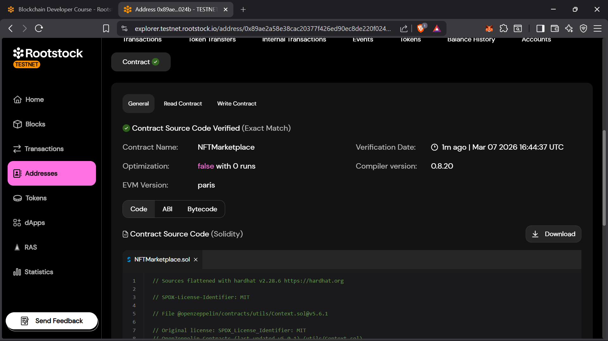
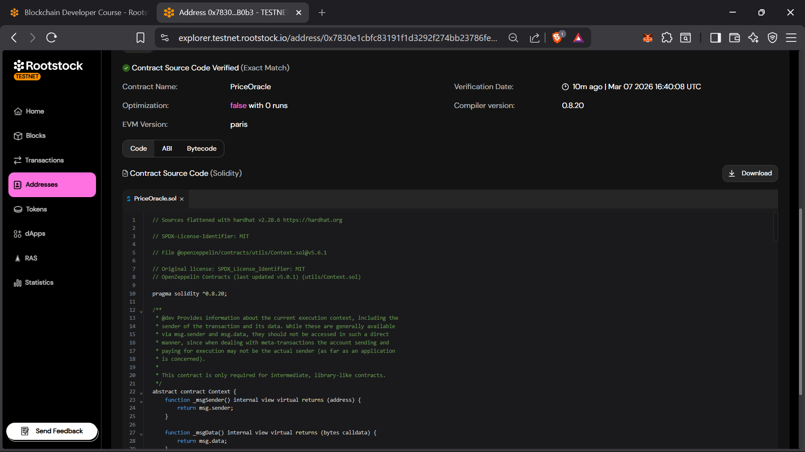

# Module 7 Assessment - Smart Contract Verification

Complete this file after deploying and verifying your contracts on RSK Testnet.

---

## (1) Verified Contract URLs

Provide the RSK Testnet Explorer URLs for each verified contract:

### SimpleToken
```text
https://explorer.testnet.rootstock.io/address/0x639f3b62c69bbd2d39b950f0d40d620bb62cd672
```

### PriceOracle
```text
https://explorer.testnet.rootstock.io/address/0x7830e1cbfc83191f1d3292f274bb23786fe1b0b3
```

### NFTMarketplace
```text
https://explorer.testnet.rootstock.io/address/0x89ae2a58e38cac20377f426ed90ec8de220f024b
```

---

## (2) Screenshot - Verification Form

Provide a screenshot of the RSK Testnet Explorer verification form for **one** of your contracts.
This should show the form filled out with the correct settings (compiler version, EVM version, etc.)



---

## (3) Screenshot - Verified Code Tab

Provide a screenshot of the RSK Testnet Explorer "Code" tab after successful verification for **one** of your contracts.
This should show the green checkmark and the verified source code.



---

## Notes (Optional)

Add any notes or observations from your verification process:

```text
Using a different fork (I used the default Prague) results in verification error.
```


Step 1: Deploying SimpleToken...
   SimpleToken deployed to: 0x639f3b62C69Bbd2d39b950F0d40d620Bb62cd672

Step 2: Deploying PriceOracle...
   PriceOracle deployed to: 0x7830e1cBFC83191F1d3292F274Bb23786Fe1B0B3

Step 3: Deploying NFTMarketplace...
   NFTMarketplace deployed to: 0x89AE2A58E38Cac20377f426ED90Ec8de220f024B
